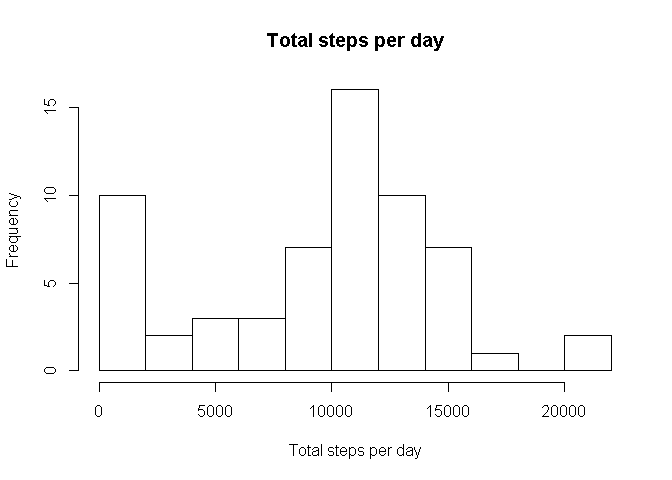
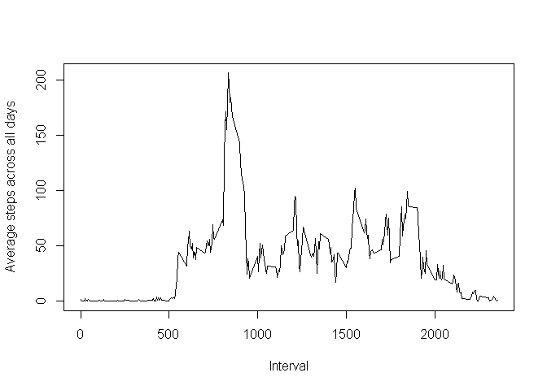
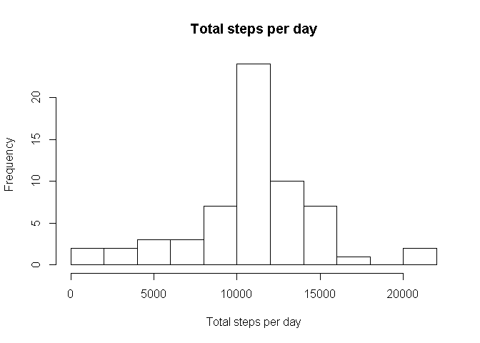
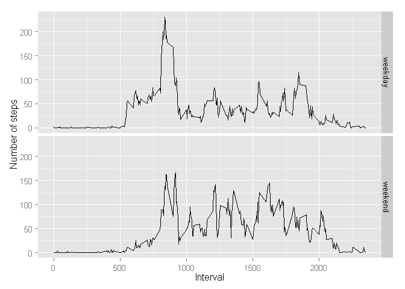

# repdata-project-1
Wen Yao  
Sunday, July 13, 2014  

# Reproducible Research: Peer Assessment 1

The data consists of two months of data from an anonymous individual collected during the months of October and November, 2012 and include the number of steps taken in 5 minute intervals each day.

## Loading the data into R.

```r
datIn <- read.csv("activity.csv", as.is=T)
dim(datIn)
```

```
## [1] 17568     3
```

```r
head(datIn)
```

```
##   steps       date interval
## 1    NA 2012-10-01        0
## 2    NA 2012-10-01        5
## 3    NA 2012-10-01       10
## 4    NA 2012-10-01       15
## 5    NA 2012-10-01       20
## 6    NA 2012-10-01       25
```

```r
sapply(datIn, class)
```

```
##       steps        date    interval 
##   "integer" "character"   "integer"
```

## What is mean total number of steps taken per day?
The result is stored in the variable "steps_by_day".

```r
library(plyr)
steps_by_day <- ddply(datIn, .(date), function(df){
  total_steps_day <- sum(df$steps, na.rm=T)
  mean_steps_day <- mean(df$steps, na.rm=T)
  median_steps_day <- median(df$steps, na.rm=T)
  return(c(total_steps_day, mean_steps_day, median_steps_day))
})
names(steps_by_day)[2:4] <- 
  c("total_steps_day", "mean_steps_day", "median_steps_day")
dim(steps_by_day)
```

```
## [1] 61  4
```

```r
head(steps_by_day)
```

```
##         date total_steps_day mean_steps_day median_steps_day
## 1 2012-10-01               0            NaN               NA
## 2 2012-10-02             126         0.4375                0
## 3 2012-10-03           11352        39.4167                0
## 4 2012-10-04           12116        42.0694                0
## 5 2012-10-05           13294        46.1597                0
## 6 2012-10-06           15420        53.5417                0
```

```r
sapply(steps_by_day, class)
```

```
##             date  total_steps_day   mean_steps_day median_steps_day 
##      "character"        "numeric"        "numeric"        "numeric"
```

Histogram of the total number of steps taken each day.

```r
hist(steps_by_day$total_steps_day, xlab="Total steps per day",
     main="Total steps per day", breaks=10)
```

 


## What is the average daily activity pattern?
The result is stored in the variable "steps_interval".
Make a time series plot of the 5-minute interval (x-axis) and the average number of steps taken, averaged across all days (y-axis).

```r
steps_interval <- ddply(datIn, .(interval), function(df){
  return(mean(df$steps, na.rm=T))
})
names(steps_interval)[2] <- "mean_steps"
head(steps_interval)
```

```
##   interval mean_steps
## 1        0    1.71698
## 2        5    0.33962
## 3       10    0.13208
## 4       15    0.15094
## 5       20    0.07547
## 6       25    2.09434
```

```r
plot(steps_interval$interval, steps_interval$mean_steps, type="l", xlab="Interval", ylab="Average steps across all days")
```

 

Which 5-minute interval, on average across all the days in the dataset, contains the maximum number of steps?

```r
steps_interval$interval[which.max(steps_interval$mean_steps)]
```

```
## [1] 835
```

## Imputing missing values.
Calculate and report the total number of missing values in the dataset.

```r
head(datIn)
```

```
##   steps       date interval
## 1    NA 2012-10-01        0
## 2    NA 2012-10-01        5
## 3    NA 2012-10-01       10
## 4    NA 2012-10-01       15
## 5    NA 2012-10-01       20
## 6    NA 2012-10-01       25
```

```r
length(which(is.na(datIn$steps)))
```

```
## [1] 2304
```

Use the mean for each 5-minute interval to impute 
missing values.
Create a new dataset that is equal to the original dataset but with the missing data filled in.
The imputed dataset is now the variable "datImputed".

```r
datImputed <- datIn
for (i in 1:nrow(datImputed)) {
  if (is.na(datImputed$steps[i])) {
    datImputed$steps[i] <- 
      mean(datIn$steps[datIn$interval==datImputed$interval[i]], na.rm=T)
  }
}
head(datImputed)
```

```
##     steps       date interval
## 1 1.71698 2012-10-01        0
## 2 0.33962 2012-10-01        5
## 3 0.13208 2012-10-01       10
## 4 0.15094 2012-10-01       15
## 5 0.07547 2012-10-01       20
## 6 2.09434 2012-10-01       25
```

Make a histogram of the total number of steps taken each day and Calculate and report the mean and median total number of steps taken per day. 
Do these values differ from the estimates from the first part of the assignment? 
No unless there are no data for that day in the origin data.
What is the impact of imputing missing data on the estimates of the total daily number of steps?
No impact unless there are no data for that day in the origin data.

```r
steps_by_day_imputed <- ddply(datImputed, .(date), function(df){
  total_steps_day <- sum(df$steps, na.rm=T)
  mean_steps_day <- mean(df$steps, na.rm=T)
  median_steps_day <- median(df$steps, na.rm=T)
  return(c(total_steps_day, mean_steps_day, median_steps_day))
})
names(steps_by_day_imputed)[2:4] <- 
  c("total_steps_day", "mean_steps_day", "median_steps_day")
dim(steps_by_day_imputed)
```

```
## [1] 61  4
```

```r
head(steps_by_day_imputed)
```

```
##         date total_steps_day mean_steps_day median_steps_day
## 1 2012-10-01           10766        37.3826            34.11
## 2 2012-10-02             126         0.4375             0.00
## 3 2012-10-03           11352        39.4167             0.00
## 4 2012-10-04           12116        42.0694             0.00
## 5 2012-10-05           13294        46.1597             0.00
## 6 2012-10-06           15420        53.5417             0.00
```

```r
sapply(steps_by_day_imputed, class)
```

```
##             date  total_steps_day   mean_steps_day median_steps_day 
##      "character"        "numeric"        "numeric"        "numeric"
```

```r
hist(steps_by_day_imputed$total_steps_day, xlab="Total steps per day",
     main="Total steps per day", breaks=10)
```

 

```r
dim(steps_by_day_imputed)
```

```
## [1] 61  4
```

```r
dim(steps_by_day)
```

```
## [1] 61  4
```

## Are there differences in activity patterns between weekdays and weekends?
In Chinese, "星期六" is Saturday and "星期日" is Sunday.
Create a new factor variable in the dataset with two levels – “weekday” and “weekend” indicating whether a given date is a weekday or weekend day.

```r
head(datImputed)
```

```
##     steps       date interval
## 1 1.71698 2012-10-01        0
## 2 0.33962 2012-10-01        5
## 3 0.13208 2012-10-01       10
## 4 0.15094 2012-10-01       15
## 5 0.07547 2012-10-01       20
## 6 2.09434 2012-10-01       25
```

```r
for (i in 1:nrow(datImputed)) {
  datImputed$day[i] <- ifelse(weekdays(as.Date(datImputed$date[i]))%in%c("星期六", "星期日"), "weekend", "weekday")
}
sapply(datImputed, class)
```

```
##       steps        date    interval         day 
##   "numeric" "character"   "integer" "character"
```

```r
datImputed$day <- factor(datImputed$day)
```

Make a panel plot containing a time series plot of the 5-minute interval (x-axis) and the average number of steps taken, averaged across all weekday days or weekend days (y-axis).

```r
steps_interval_day <- ddply(datImputed, .(interval, day), function(df){
  return(mean(df$steps, na.rm=T))
})
dim(steps_interval_day)
```

```
## [1] 576   3
```

```r
names(steps_interval_day)[3] <- "mean_steps"
head(steps_interval_day)
```

```
##   interval     day mean_steps
## 1        0 weekday    2.25115
## 2        0 weekend    0.21462
## 3        5 weekday    0.44528
## 4        5 weekend    0.04245
## 5       10 weekday    0.17317
## 6       10 weekend    0.01651
```

```r
library(ggplot2)
p1 <- ggplot(steps_interval_day) + geom_line(aes(x=interval,
                                                 y=mean_steps)) + facet_grid(day~.) + xlab("Interval") +
  ylab("Number of steps")
p1
```

 


